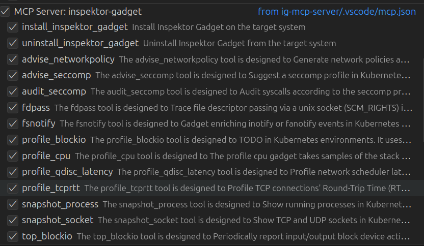

# Inspektor Gadget MCP Server

The Inspektor Gadget MCP Server enables you to debug and inspect Kubernetes clusters using various gadgets through an AI-powered interface.

https://github.com/user-attachments/assets/86367982-c0aa-455c-ac9e-ca43348899df

## Features

- AI-powered interface to troubleshoot and monitor your workloads on Kubernetes clusters
- Deploy and undeploy Inspektor Gadget with ease
- Understand and summarize gadget output through AI assistance
- Discover gadgets from Artifact Hub automatically

## Quick Start

1. Ensure you have Docker and a valid `kubeconfig` file
2. Configure the MCP server in VS Code (see [Installation](#installation))
3. Start using AI-powered debugging in VS Code Copilot Chat
4. Ask questions like: "Show me DNS traffic for cluster" or "Deploy Inspektor Gadget"

## Installation

### Prerequisites

- A `kubeconfig` file with access to your Kubernetes cluster.
- [Inspektor Gadget installed](https://inspektor-gadget.io/docs/latest/reference/install-kubernetes) in the cluster (you can use the official installation instructions or utilize the MCP tools to deploy/undeploy Inspektor Gadget).

### Using MCP Client

#### VS Code

[VS Code supports MCP](https://code.visualstudio.com/docs/copilot/chat/mcp-servers), allowing you to connect to the MCP server. You can configure the MCP server in VS Code using either of the following methods:

##### Centralized User Settings

Configure the MCP server in your user settings by opening the command palette (Ctrl+Shift+P) and selecting "Preferences: Open User Settings (JSON)". Add the following configuration:

```json
{
    "mcp": {
        "inspektor-gadget": {
            "type": "stdio",
            "command": "docker",
            "args": [
                "run",
                "-i",
                "--rm",
                "-v", "~/.kube/config:/kubeconfig:ro",
                "-e", "KUBECONFIG=/kubeconfig",
                "ghcr.io/inspektor-gadget/ig-mcp-server:latest",
                "-gadget-discoverer=artifacthub"
            ]
        }
    }
}
```

##### Workspace Settings

Alternatively, configure the MCP server for a specific workspace by creating `.vscode/mcp.json` in your project/workspace directory:

```json
{
  "servers": {
    "inspektor-gadget": {
      "type": "stdio",
      "command": "docker",
      "args": [
        "run",
        "-i",
        "--rm",
        "-v",
        "~/.kube/config:/kubeconfig:ro",
        "-e",
        "KUBECONFIG=/kubeconfig",
        "ghcr.io/inspektor-gadget/ig-mcp-server:latest",
        "-gadget-discoverer=artifacthub"
      ]
    }
  }
}
```

## Usage Examples

### Basic Commands

Once configured, you can interact with the MCP server through VS Code Copilot Chat:

```
Deploy Inspektor Gadget to my cluster
```

```
Run #trace_dns gadget on namespace default
```

```
Show me network connections for pod nginx
```

### Available Gadgets

Common gadgets available through Artifact Hub include:
- `trace_dns` - Trace DNS requests
- `trace_exec` - Trace process execution
- `top_process` - Monitor CPU and memory usage of processes
- `top_file` - Show file I/O activity
- `snapshot_process` - Capture running processes

See the full list of gadget at [artifacthub](https://artifacthub.io/packages/search?kind=22&sort=relevance&page=1).

## Configuration Options

The MCP server supports several command-line options:

| Option | Description | Default |
|--------|-------------|---------|
| `-gadget-discoverer` | Gadget discovery method (`artifacthub`) | "" |
| `-gadget-images` | Manually specify gadget images | "" |

## Troubleshooting

### Common Issues

**Docker permission errors:**
```bash
# Add your user to the docker group
sudo usermod -aG docker $USER
# Log out and back in for changes to take effect
```

**Kubeconfig not found:**
- Ensure your kubeconfig file exists at `~/.kube/config`
- Check that the path is correctly mounted in the Docker command
- Verify cluster connectivity: `kubectl cluster-info`
- If your kubeconfig includes certificate paths, make sure to mount them using Docker volumes or run the binary directly on the host

**MCP server not responding:**
- Check VS Code MCP extension is enabled
- Verify Docker is running: `docker --version`
- Review VS Code developer console for error messages

**Gadgets not loading:**
- Ensure internet connectivity for Artifact Hub discovery
- Try manual gadget specification: `-gadget-images=trace_dns:latest`
- Check Inspektor Gadget deployment: `kubectl get pods -n gadget-system`

**Token Limit Reached:**
- If your MCP client isn't able to summarize the gadget run, it is possible you are hitting the token limit. In that case, try to run the gadget with a smaller timeout and use filtering afterwards to focus on a specific workload.

### Debug Mode

Enable verbose logging by adding `-log-level=debug` flag to the Docker command:

```json
"args": [
  "run", "-i", "--rm",
  "-v", "~/.kube/config:/kubeconfig:ro",
  "-e", "KUBECONFIG=/kubeconfig",
  "ghcr.io/inspektor-gadget/ig-mcp-server:latest",
  "-gadget-discoverer=artifacthub",
  "-log-level=debug"
]
```

## MCP Tools

The server provides several built-in tools for managing Inspektor Gadget and running gadgets:

### deploy_inspektor_gadget

Deploys Inspektor Gadget to your Kubernetes cluster.

### undeploy_inspektor_gadget

Removes Inspektor Gadget from your Kubernetes cluster.

### Gadgets

The server supports two methods for gadget discovery:

#### Artifact Hub Discovery

Use `artifacthub` as a gadget discoverer (`-gadget-discoverer=artifacthub`) to automatically discover and register gadgets from Artifact Hub. Each discovered gadget becomes available as an MCP tool.



#### Manual Gadget Discovery

Alternatively, you can specify gadgets directly using the command line option `-gadget-images=trace_dns:latest`.

## Building from Source

```bash
# Clone the repository
git clone https://github.com/inspektor-gadget/ig-mcp-server.git
cd ig-mcp-server

# Build the Docker image
make
```

## Contributing

We welcome contributions! Please:

1. Fork the repository
2. Create a feature branch: `git checkout -b feature/my-feature`
3. Make your changes and add tests
4. Submit a pull request

### Development Setup

TBD

## Security Considerations

- The MCP server requires access to your kubeconfig file
- Docker container runs with your kubeconfig mounted as read-only
- Network access is required for Artifact Hub gadget discovery
- Ensure your Kubernetes cluster has appropriate RBAC policies

## License

This project is licensed under the Apache License 2.0 - see the [LICENSE](LICENSE) file for details.

## Support

- 📖 [Documentation](https://inspektor-gadget.io/docs/)
- 🐛 [Issue Tracker](https://github.com/inspektor-gadget/ig-mcp-server/issues)
- 💬 [Community Slack](https://kubernetes.slack.com/channels/inspektor-gadget)
- 🌐 [Website](https://inspektor-gadget.io/)

## Related Projects

- [Inspektor Gadget](https://github.com/inspektor-gadget/inspektor-gadget) - Kubernetes debugging tool
- [MCP Specification](https://spec.modelcontextprotocol.io/) - Model Context Protocol specification